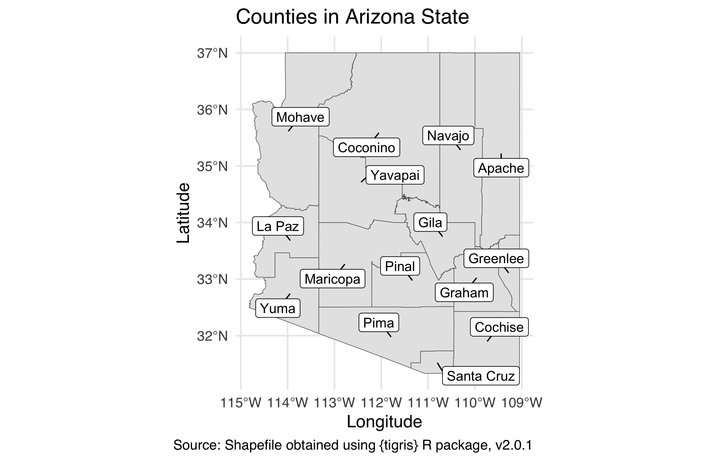
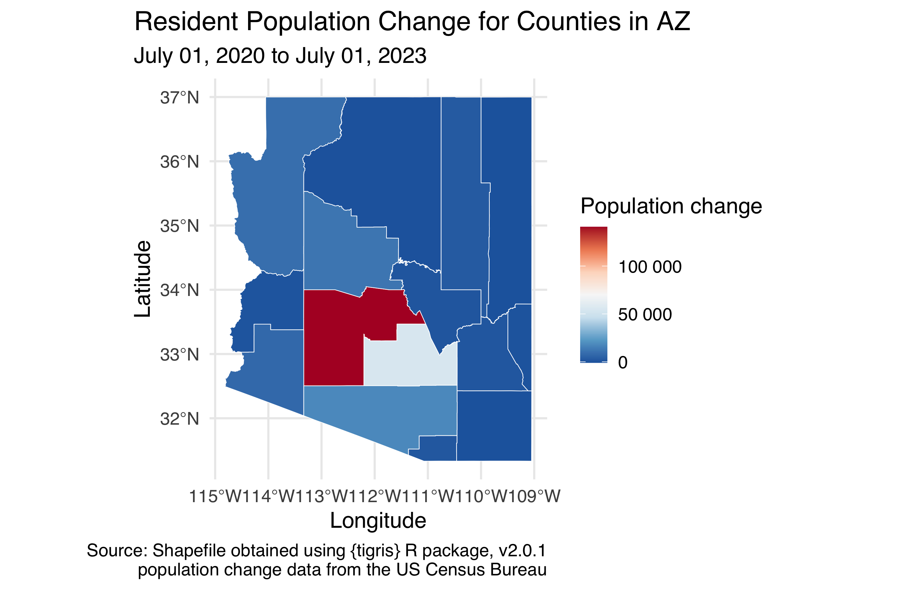
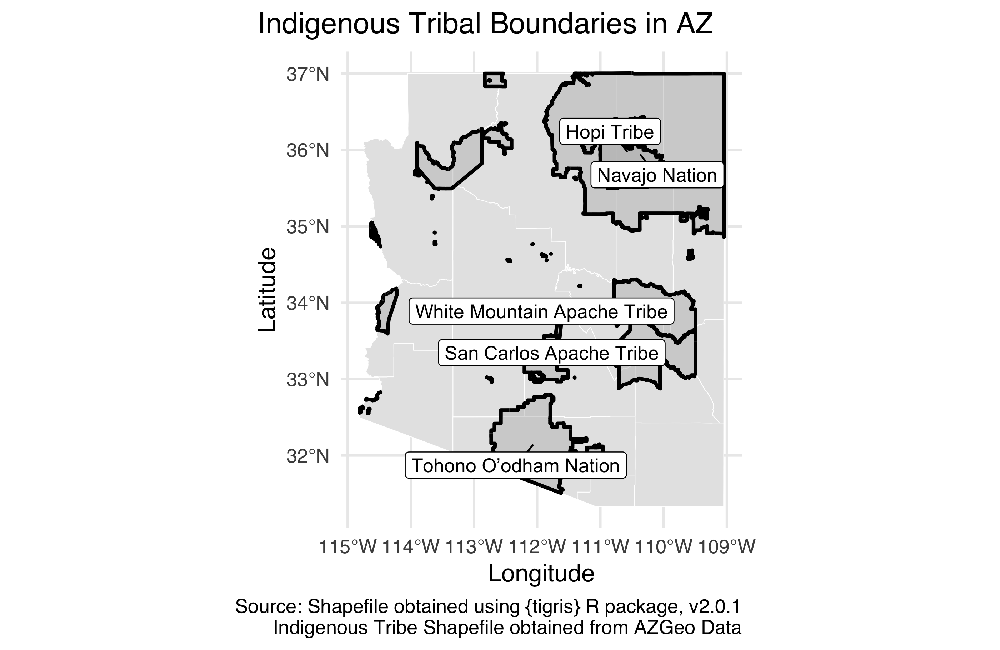
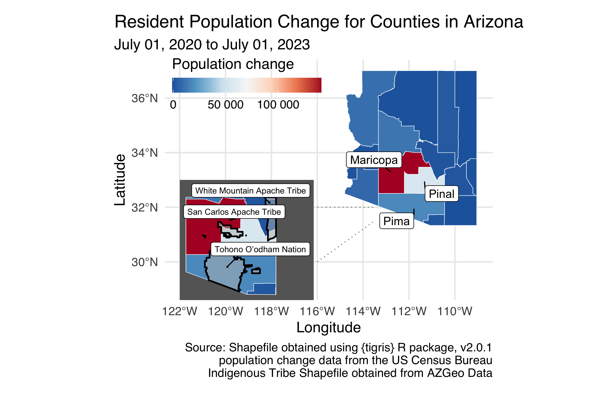

Homework 04
================

For any exercise where you’re writing code, insert a code chunk and make sure to label the chunk. Use a short and informative label. For any exercise where you’re creating a plot, make sure to label all axes, legends, etc. and give it an informative title. For any exercise where you’re including a description and/or interpretation, use full sentences. Make a commit at least after finishing each exercise, or better yet, more frequently. Push your work regularly to GitHub. Once you’re done, inspect your GitHub repo to make sure you've pushed all of your changes.

## Question 1

**A second chance.** Take one of the visualizations from your first project, ideally one you received more feedback on / lost more points on and improve it. First, write one sentence reminding us of your project and a a few sentences on why you chose this plot and how you plan to improve it. Some of these improvements might be "fixes" for things that were pointed out as missing or incorrect. Some of them might be things you hoped to do before the project deadline, but didn't get a chance to. And some might be things you wanted to do in your project but your teammates didn't agree so you gave up on at the time. Some notes for completing this assignment:

-   You will need to add your data from your project to the `data/` folder in this assignment. You do not need to also add the data dictionary.
-   You will need to copy over any code needed for cleaning / preparing your data for this plot. You can reuse code from your project but note that we will re-evaluate your code as part of the grading for this exercise. This means we might catch something wrong with it that we didn't catch before, so if you spot any errors make sure to fix them.
-   Don't worry about being critical of your own work. Even if you lost no points on the plot, if you think it can be improved, articulate how / why.We will not go back and penalize for any mistakes you might point out that we didn't catch at the time of grading your project. There's no risk to being critical!

------------------------------------------------------------------------

## **Arizona state of mind.** 

In the remainder of this assignment you’ll work with data on population change from 2021 to 2022 in counties of Arizona state.

### Important!
Each of the following questions ask you to reproduce a plot. You must use ggplot2 and start with the data provided. You may not use screenshots of the figures provided, in part or in full, as part of your solution.

## Question 2

**Arizona state of counties.** Using the **tigris** package, download the shapefile for counties in the state of Arizona (AZ) for year 2021. Cache the code chunk where this action is done so the shapefile isn’t downloaded each time you render. Then, in a separate code chunk, plot the county boundaries and label them. The word “County” should be omitted from the labels to keep them shorter, appropriate labels should be used, including a caption that mentions the data source, and the figure should be sized such that all labels are visible. It's ok if your labels are not placed in the exact same locations as the provided figure.

**Hint:** When downloading the shape file, set `progress_bar = FALSE` so that the progress bar isn’t printed in your rendered document.

## Question 3

**Arizona state of population change.** TL;DR: Reproduce the figure below. But you’re going to want to read more…

Next, fill in the color of the counties based on total population change from 2021 to 2022 using a *diverging* `RdBu` color palette. In order to do this, you will need to merge in the Excel file called `co-est2023-pop-04.xlsx` from your `data` folder to the shape file you loaded in the previous exercise. The Excel file is formatted such that there are merged cells on top that you don’t need as well as extraneous informational text at the bottom, so you will need to make use of additional arguments to the `read_excel()` package to skip some rows on top, limit the number of rows being read in, and label the columns appropriately. Label the column you will use for this analysis `total_pop_change_20_23`; note that this is variable name will then be reflected in the title of the legend in your figure by default, so change it accordingly. Do not label the counties so that we can see the map and the fill colors better, but do use appropriate labels should, including a caption that mentions the data sources, and use an appropriate aspect ratio and size for your figure.

**Hint:** There are 15 counties in New York State.

## Question 4

**Arizona state of Indiginous Tribal Regions.** TL;DR: Reproduce the figure below. But you’re going to want to read more…

Arizona is home to 22 federally recognized tribes, including 17 reservations that cross several AZ counties.. These regions are given in the shapefiles in your `data` folder (use `American_Indian_Reservations_in_Arizona.shp`). Standardize the shapefile with the AZ counties one (**hint**: rh crs code is 4269). Then, create a new `sf` object that has the boundaries of the tribal regions that overlays the `sf()` layer for you created in the previous exercise, using a thicker line (`linewidth = 1`) to indicate indigenous region boundaries. It's ok if your labels are not placed in the exact same locations as the provided figure.

**Hints:**

-   Merging/standardizing geographic areas is not something we’ve done in class previously, so you will need to figure out what tools to use to create these boundaries. It’s one of the `st_*()` functions from the [**sf**](https://r-spatial.github.io/sf/reference/index.html) package.
-   The `nudge_x` and `nudge_y` arguments to `geom_label_repel()` can be helpful to nudge the labels in a consistent manner away from the centers of the regions.

## Question 5

**Arizona state of patchwork.** TL;DR: Reproduce the figure below. But you’re going to want to read more…

What we’re seeing is that what is happening in some Arizona counties is very different than the rest of Arizona State, which is probably not too surprising given urban vs rural populations. We also have too many potantial tribal regions to get clear ideas of which tribes are in the most populous regions of Arizona. åSo, let’s make it a bit easier to see each of the counties in Arizona by insetting a zoomed-in version of that portion of the map. It's ok if your labels are not placed in the exact same locations as the provided figure.

**Hint:** The `inset_element()` function from the **patchwork** package will be helpful!

